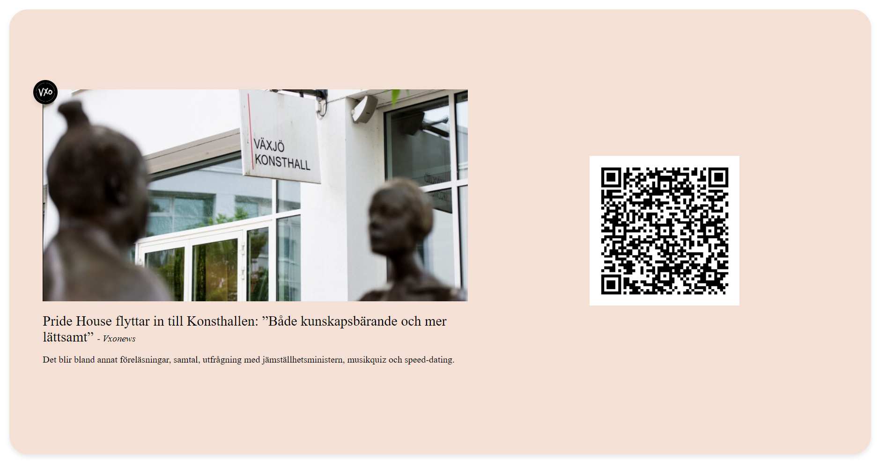
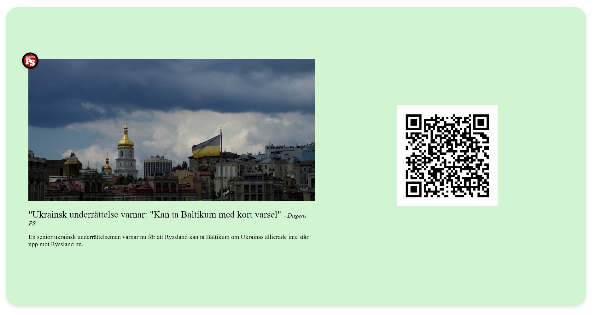

# NewsApp

 

The News App is a dynamic application designed to provide display a variety of news content on the TFT screens inside transit vehicles. This system aims to provide passengers with current news, tailored content based on location, and significant global headlines.

## Features

- **Fetching News Data**: Automatically fetches news articles and headlines from reputable sources.
- **Diverse News Coverage**:Provides a broad spectrum of news content, including local, national, and international news, ensuring passengers have access to comprehensive information.
- **Location-based News Filtering**:Adjusts the news feed according to the vehicle's current location or route, ensuring passengers receive timely updates on relevant local news.
-**QR Code**: Users have the option to scan QR codes, which directly link to the respective article's page.

## How to Run

1. Clone the repository to your local environment.
2. Install dependencies using `npm install`.
3. Run the application using `ng serve`.
4. Navigate to `http://localhost:4200/` in your web browser.

## How to Use

- In the main view of the application, users will see new first will be print local then nationa nad las international
- Each news item includes an image, title, subtitle, QR code, and source name.
- News rotates every 20 seconds.
- Each type of news has its own background:

| Local                            | National                               | International                                    |
| -------------------------------- | -------------------------------------- | ------------------------------------------------ |
|  |  |  |
